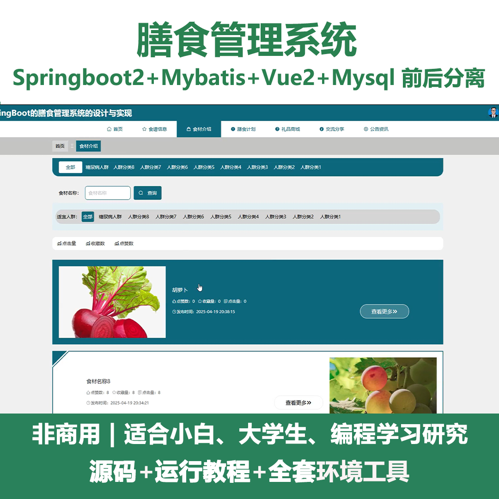
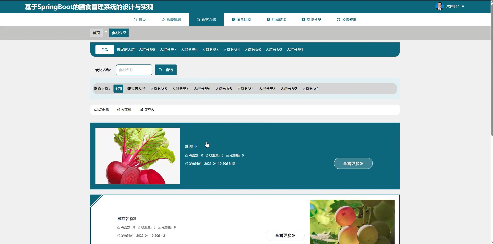
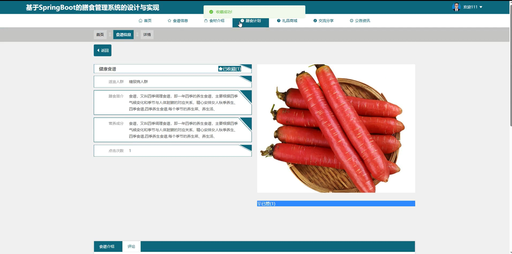
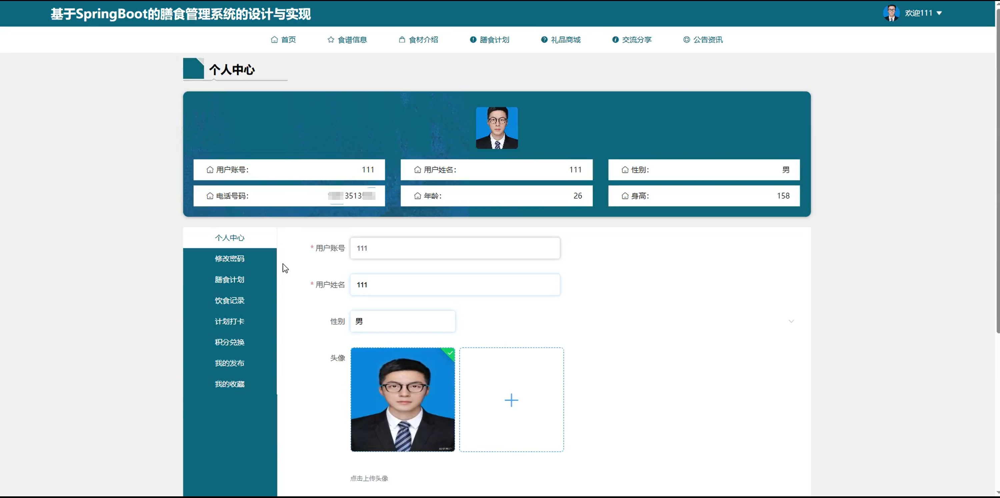
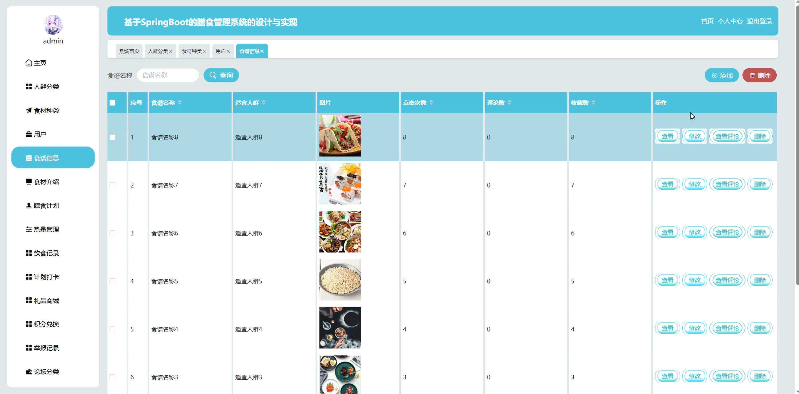
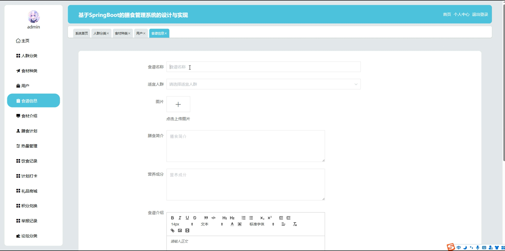
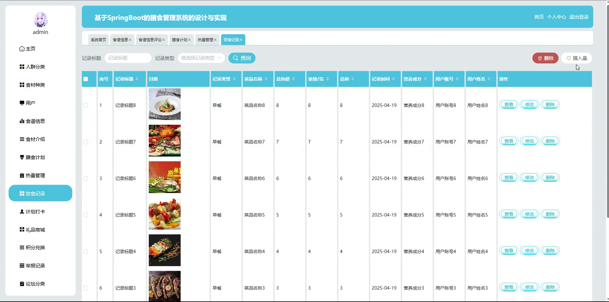
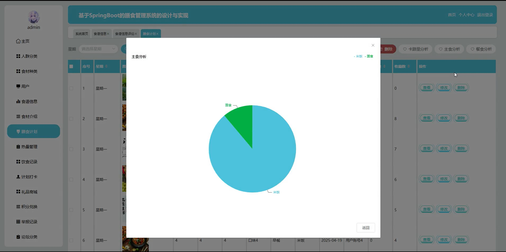

# springbootA423D
springbootA423D膳食管理系统
 
## 查看主页获取源码

### 一、关键词
食谱信息、食材介绍、膳食计划

### 二、作品包含
源码+数据库+全套环境和工具资源+本地部署教程

### 三、项目技术
前端技术：Html、Css、Js、Vue2.0、Element-ui 
后端技术：Java、SpringBoot2.0、MyBatis

### 四、运行环境（以下版本亲测，其他版本未知，请自测）
开发工具：IDEA/eclipse  + VSCODE

数据库：MySQL5.7（最低要5.7版本）

数据库管理工具：Navicat10以上版本

环境配置软件： JDK1.8 + Maven3.6.3

前端Nodejs：14

浏览器：谷歌浏览器

### 五、项目介绍
项目编号：springbootA423D

膳食管理系统能科学规划、管理饮食，助力实现营养均衡、健康管理及饮食相关事务高效运作。

角色：管理员、用户

用户功能：首页、食谱信息、食材介绍、膳食计划、礼品商城、交流分享、公告资讯、个人中心、修改密码、膳食计划、饮食记录、计划打卡、积分兑换、我的发布、我的收藏。

管理员功能：主页、人群分类、食材种类、用户、食谱信息、食材介绍、膳食计划、热量管理、饮食记录、计划打卡、礼品商城、积分兑换、举报记录、论坛分类、交流分享、系统管理、个人中心。

### 六、运行截图

